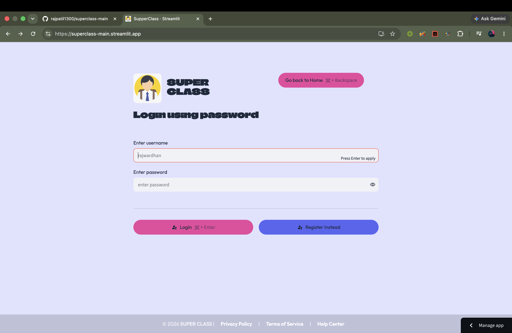
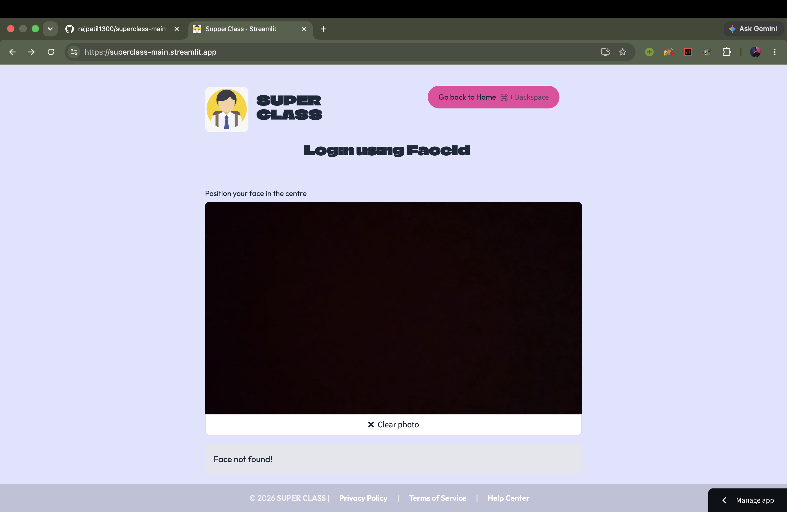
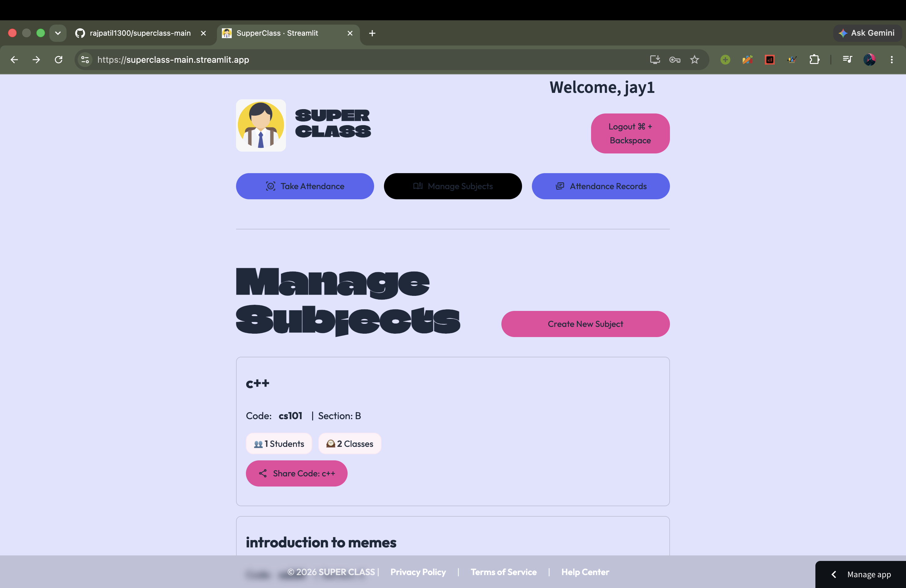
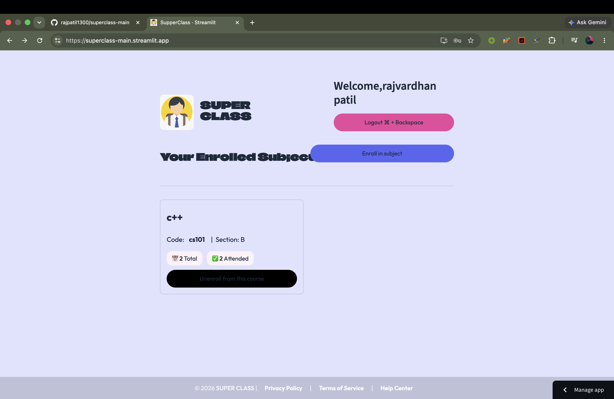

# Superclass: AI Attendance System

Superclass is a web application designed to modernize and automate classroom attendance. Instead of manually calling out names, teachers can use artificial intelligence to mark attendance instantly using classroom photos or voice recognition. 

The system provides a seamless experience for both educators and students through a clean, easy-to-use web interface.

## How It Works

**Dual Portals**
The application features a dedicated login system that routes users to either a Student Portal or a Teacher Portal based on their account type.




**Teacher Dashboard**
Teachers have full control over their classes. From the dashboard, they can:
* Create new subjects and generate unique shareable codes for students.
* Take AI Attendance by uploading classroom photos for bulk facial recognition.
* Use Voice Attendance by recording audio of students speaking.
* View detailed attendance records and statistics for past classes.



**Student Dashboard**
Students have a streamlined view focused on their academic progress. They can:
* Enroll in new subjects using the codes provided by their teachers.
* Track their personal attendance history, seeing exactly how many classes they have attended versus the total held.
* Unenroll from courses as needed.



## Tech Stack

* Frontend: Python, Streamlit, Pandas
* Backend & Database: PostgreSQL hosted on Supabase
* AI/ML: Python audio and image processing libraries

## Local Setup and Installation

To run this project locally on your own machine, follow these steps. You will need Python installed and a Supabase database configured.

1. Clone the repository:
   ```bash
   git clone [https://github.com/rajpatil1300/superclass-main.git](https://github.com/rajpatil1300/superclass-main.git)
   cd superclass-main